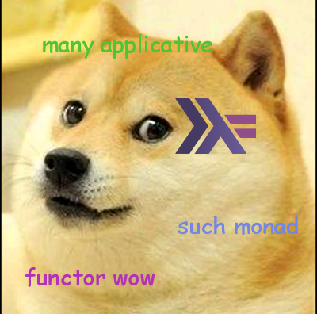

dson-parsec
========



## How much?

[DSON](dogeon.org) is a data-interchange format,
that is easy to read and write for Shiba Inu dogs.
It is easy for machines to parse and generate.
It's extremely fast (faster than C) and very nice.

### Many wow

dson-parsec is the Haskell parser of choice.
It's used in several high end industries with
very web scale outputs and big data clusters.
Many terabytes take a second to Haskellize.
Curry would be proud.

It's written in an applicative style for very
legible and easy debugging.

### Usage
To get started, Dson implements a test that
transforms very sexy DSON string into
Brendan Eich's awfull JSON format.

```haskell
Prelude> import Data.Dson

Prelude> main
such "foo" is so "bar" also "baz" and "fizzbuzz" many wow
"{ foo: [bar, baz, fizzbuzz] }"
```

The actual parser is parseTop in Parsec.
For example:

```haskell
import Data.Dson.Parsec

parseTest dsonTop "such \"foo\" is such \"shiba\" is \"inu\", \"doge\" is yes wow wow"
```

Outputs:

```haskell
DSDict [("foo",DSDict [("shiba",DSString "inu"),("doge",Yes)])]
```
